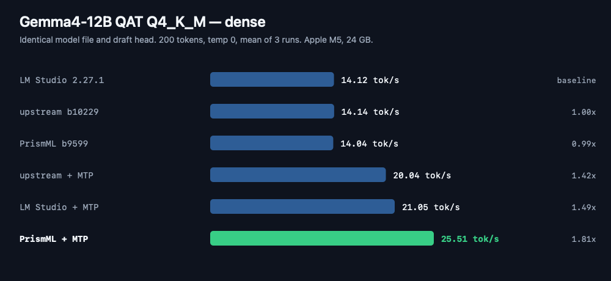
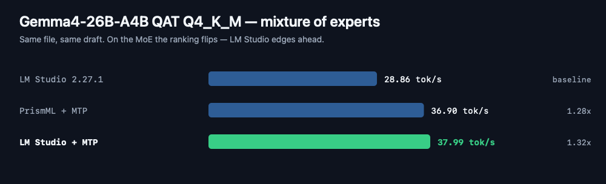
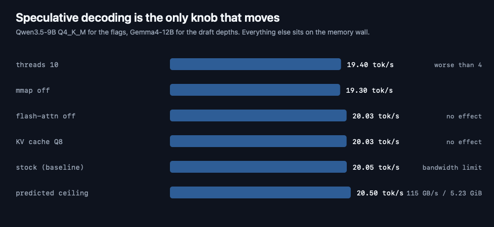
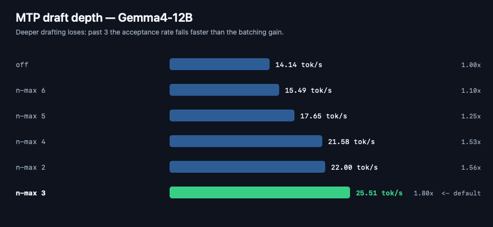
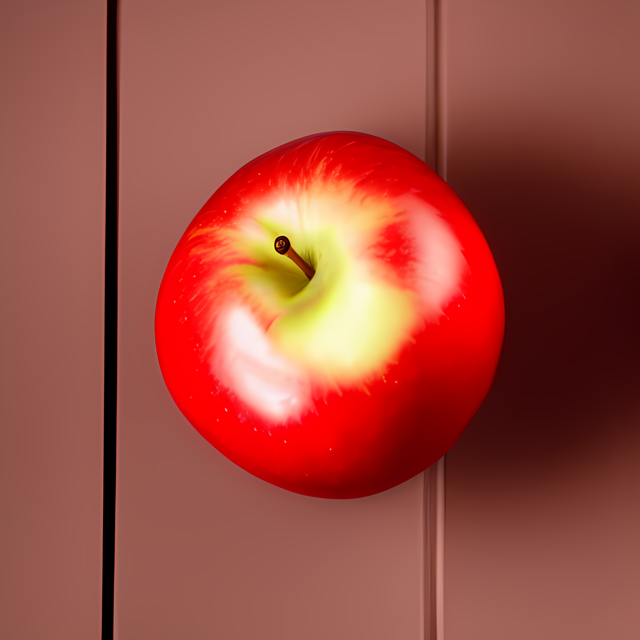
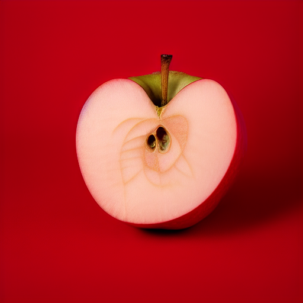

<div align="center">


# Solid-LM

**A native macOS app for local LLMs, image generation, and speech — with speculative decoding on by default.**

No Electron. No web view. No localhost UI server. Real SwiftUI, and it builds in ten seconds
without Xcode.


**[⬇ Download 1.0.0](https://github.com/LivingG0D/Solid-LM/releases/latest)** · 2.3 MB · Apple silicon

</div>

---

## Why this exists

Local LLM front-ends are mostly Electron wrapping a web UI wrapping a server. Solid-LM is a real
Mac app that treats inference engines the way a browser treats tabs: it spawns them, talks to them
over HTTP, and gets out of the way.

The interesting part is what came out of measuring it. **Generation speed is bound by memory
bandwidth, not by settings** — so most tuning advice is noise. The one thing that does work,
speculative decoding, is enabled automatically here whenever a model ships a draft head.

## Benchmarks

Every engine measured the same way: same GGUF file, same prompt, 200 tokens, temperature 0,
one warm-up then the mean of 3 runs, timed from the first streamed token so prompt processing never
inflates the number. One engine resident at a time — 24 GB of shared memory means two would corrupt
the results. Chunk counting was validated against llama.cpp's own `predicted_per_second`:
**14.26 vs 14.26**, exact.

Hardware: Apple M5, 10 GPU cores, 24 GB unified memory, macOS 26.6.

### Dense model — Gemma4-12B QAT Q4_K_M



### Mixture of experts — Gemma4-26B-A4B QAT Q4_K_M



**The ranking flips.** PrismML is 21% ahead on the dense model and 3% behind on the MoE. Anyone
telling you one llama.cpp build is simply "the fast one" has benchmarked exactly one model.

### Nothing you can configure matters



The three stock llama.cpp builds land within **0.7%** of each other because they are the same engine
against the same wall. `115 GB/s ÷ 5.23 GiB` predicts 20.5 tok/s; Qwen3.5-9B measures **20.05**.
Within 2%.

| Knob | Result |
|---|---|
| Flash attention on / off | 19.95 / 20.03 — no effect at short context |
| KV cache Q8 vs F16 | 20.03 / 20.03 — none |
| Threads 4 / 8 / 10 | 20.03 / 19.78 / 19.40 — **more threads is worse** |
| mmap on / off | 19.85 / 19.30 |

### What does work: read the weights once for several tokens



An MTP draft head proposes tokens; the full model verifies them in a single pass. That is the only
way past a bandwidth ceiling. Solid-LM detects a sibling `mtp-*.gguf` and turns this on
automatically — measured **1.75× through the app's own engine**.

Depth 3 is the sweet spot. Past it the acceptance rate falls faster than the batching gains, and
every rejected token costs a wasted verification pass.

### MLX

| Engine | tok/s |
|---|---:|
| **LM Studio MLX 1.11.0** | **19.51** |
| mlx_lm 0.31.3 | 18.58 |

LM Studio's MLX engine is ~5% ahead. Reported because it is what the numbers say.

## Features

### Chat

Streaming with native markdown — syntax-highlighted code blocks, real tables, `<think>` reasoning
folded into a disclosure. Per-message tok/s · tokens · TTFT. Edit-and-resend, regenerate, stop.
Return sends, Shift-Return newlines.

### Models

Scans your models folder and sorts by estimated speed, with quant, size and a memory-fit dot.
Per-model load config: context, GPU layers, flash attention, Q8 KV cache, speculative decoding.

| Engine | Format | Notes |
|---|---|---|
| **llama.cpp** | GGUF | PrismML build — runs ternary and `q2_0` models others reject |
| **MLX** | safetensors | Apple's fast path via `mlx_lm.server` |
| **vLLM** | safetensors | Code path present; no Metal backend, so CPU-only on Apple silicon |

### Images

Generate, edit (img2img and inpaint) and upscale, all through
[stable-diffusion.cpp](https://github.com/leejet/stable-diffusion.cpp) on Metal.

| Generated 512×512 | ESRGAN 4× → 2048×2048 |
|:--:|:--:|
|  |  |

**Quantisation ruins diffusion models far more than language models.** Same prompt, same seed 42,
background corners averaged:

| Q4_0 — RGB 160, **0**, 14 | F16 — RGB 169, 162, 177 |
|:--:|:--:|
|  |  |
| prompted *white* background → saturated red | near-neutral grey |

The green channel collapses to zero at Q4_0. A better VAE does not fix it (`vae-ft-mse` measured
170, 164, 179) — the damage is in the weights, and CPU and Metal agree. **Use Q8_0 or F16 for image
models**, even though Q4 is perfectly fine for text. The model list warns you.

### Speech

Two engines: macOS `AVSpeechSynthesizer`, and **Kokoro-82M** through a persistent MLX worker with
54 voices. A speaker button on each reply, or auto-speak. Markdown is stripped first — a code block
is announced as "(code block)" rather than read character by character.

Measured: **~4 s to start the worker, then ~1.8 s per utterance producing 2.5–4.7 s of audio.** The
worker stays resident because a fresh process spends ~2.5 s loading before it says a word.

### Downloads

Paste a HuggingFace repo URL, pick a quant, and it pulls with 8 parallel range requests — resumable,
cancellable, atomically installed.

## Install

### Download

Grab the [latest release](https://github.com/LivingG0D/Solid-LM/releases/latest), then:

```bash
unzip SolidChat-1.0-arm64.zip
mv SolidChat.app /Applications/
xattr -dr com.apple.quarantine /Applications/SolidChat.app
open /Applications/SolidChat.app
```

The `xattr` line is not optional. The app is ad-hoc signed rather than notarised, and macOS
quarantines anything downloaded from the internet — without it the app is blocked on first launch.
Verified on a clean copy of the published zip: blocked before that command, launches after.

### Or build it

Requires **Command Line Tools only — no Xcode**, and avoids the quarantine step entirely.

```bash
git clone https://github.com/LivingG0D/Solid-LM.git
cd Solid-LM/mac
./build.sh
cp -R build/SolidChat.app /Applications/
```

`build.sh` runs `swiftc` over every source file as one whole-module optimised build (~10 s),
assembles the `.app`, and ad-hoc signs it — unsigned SwiftUI binaries are killed on launch.

### Engine backends

Solid-LM drives external engines. Point Settings ▸ Paths at yours, or use these defaults:

| Backend | Default location | Needed for |
|---|---|---|
| `llama-server` | `~/prism-llama/prism/<build>/llama-server` | GGUF chat |
| `sd-server`, `sd-cli` | `~/prism-llama/sdcpp/bin/` | images |
| Python venv | `~/github/Solid-LM/.venv/bin/python` | MLX chat, Kokoro speech |

```bash
# MLX chat + Kokoro speech
uv venv .venv --python 3.13
uv pip install --python .venv/bin/python mlx-lm mlx-audio "misaki[en]"

# images
git clone --recursive https://github.com/leejet/stable-diffusion.cpp
cd stable-diffusion.cpp
cmake -B build -DCMAKE_BUILD_TYPE=Release -DSD_METAL=ON -DGGML_METAL_EMBED_LIBRARY=ON
cmake --build build -j
```

`GGML_METAL_EMBED_LIBRARY=ON` matters: it compiles Metal shaders at runtime, so the offline `metal`
compiler that ships only with full Xcode is not required.

## Layout

```
mac/Sources/SolidChat/
  Core/    Types, ModelScanner, EngineManager, ProcessRunner, ChatClient,
           Downloader, Store, SystemStats,
           ImageTypes, ImageScanner, ImageEngine, ImageClient, ImageStore,
           SpeechTypes, SpeechEngine
  Views/   RootView, ChatView, MarkdownMessageView, ModelsView,
           ImagesView, DownloadsView, LogsView, SettingsView
  SolidChatApp.swift
mac/build.sh          swiftc -> .app bundle
kokoro/tts_worker.py  persistent Kokoro TTS worker
bench/                the benchmark harness used for every number above
```

State lives in `~/Library/Application Support/SolidChat/`.

## Notes from building this

Things that cost real time and are not obvious:

- **`mlx_lm.server` treats the request's `model` field as a HuggingFace repo id.** Send
  `publisher/name` and it silently re-downloads a model already on disk. Send the local path
  instead. Verified: zero `huggingface.co` requests during MLX generation.
- **Speculative decoding needs `-fit off`.** The memory-fitting probe fails to build a context for
  the draft (`requires ctx_other to be set`) and the server then 503s every request.
- **Full GPU offload is not the default everywhere.** An auto-chosen offload ratio measured
  **3.99 tok/s** on a 26B-A4B where full offload measured **37.9**.
- **A download resume that trusts file size will install corrupt models.** Pre-sizing gives a file
  its final length before any bytes arrive, so an interrupted transfer leaves a full-size,
  zero-filled file that looks complete. Solid-LM keeps a completion ledger instead.
- **Port cleanup must be specific.** Killing anything matching `python` on the engine port would
  take out an unrelated Jupyter kernel.

## Verification

`swiftc -typecheck` over all sources: **0 errors, 0 warnings**. Verified against real models, not mocks:

| Check | Result |
|---|---|
| Model scan | 30 models, 19 GGUF / 11 MLX; projectors, drafts and LLM files correctly excluded |
| llama.cpp load → stream → unload | 201.7 tok/s, TTFT 0.04 s, child confirmed dead after unload |
| MLX load → stream | reasoning captured, **0 huggingface.co requests** |
| Images | scan → load → txt2img 512² → ESRGAN 4× → clean teardown |
| Speech | Kokoro ready in 4 s, real audio, stop halted it, no leaked worker |
| Markdown | 19 adversarial inputs + every streaming prefix of a document |
| Settings migration | a pre-speech `settings.json` still decodes; token and samplers survive |

A six-lens adversarial review confirmed 19 defects (5 rejected on verification); all were fixed.

## Licence

MIT — see [LICENSE](LICENSE).

Solid-LM orchestrates [llama.cpp](https://github.com/ggml-org/llama.cpp),
[mlx-lm](https://github.com/ml-explore/mlx-lm),
[stable-diffusion.cpp](https://github.com/leejet/stable-diffusion.cpp) and
[Kokoro](https://huggingface.co/hexgrad/Kokoro-82M); each keeps its own licence.

Benchmark figures come from one machine and will differ on yours. The harness is in `bench/` — re-run
it rather than trusting the table.
